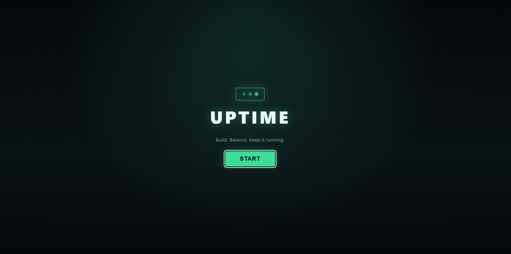
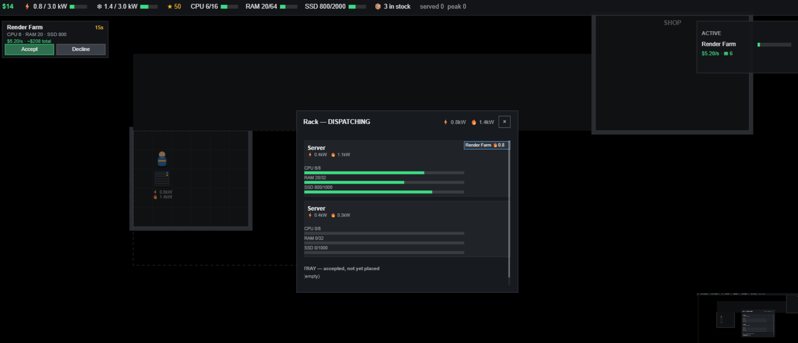

# Uptime

A top-down 2D datacenter tycoon. Walk the floor, rack and manage machines, and keep
power, cooling, and bandwidth balanced as the facility grows — workloads earn money,
which gets reinvested into more capacity.

Built with TypeScript, Canvas rendering, and a hand-rolled ECS architecture.

## Screenshots

